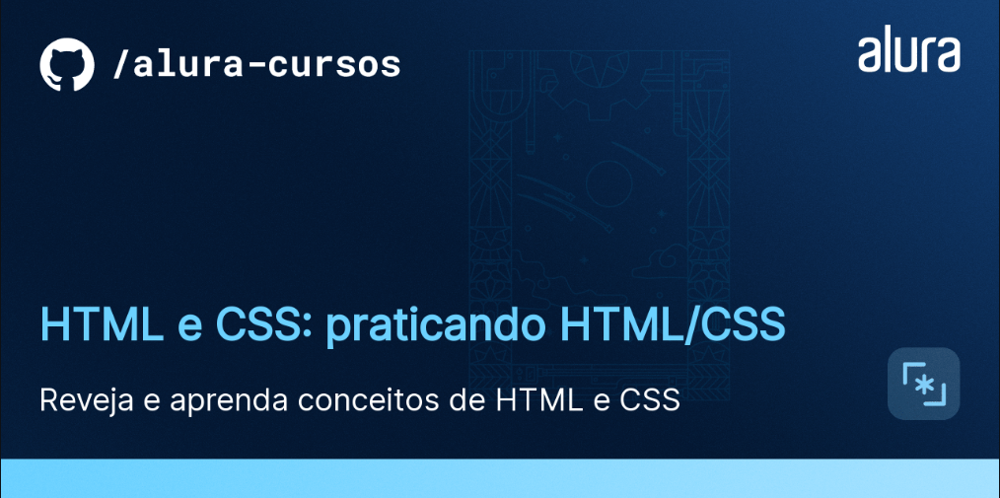

# Alura Plus

O [Figma dessa aplicação você encontra aqui](https://www.figma.com/community/file/1405548002549864433).

## ✔️ Técnicas e tecnologias utilizadas

Se liga nessa lista de tudo que usei nesse curso:

- `HTML`
- `CSS`
- `Figma`
- `Git e Github`

E muito mais!

## 🛠️ Abrir e rodar o projeto

Para abrir e rodar o projeto, utilize um editor de código de sua escolha.

Depois, abra o projeto no seu navegador.

## 📚 Mais informações do curso

O Alura Plus é uma plataforma de streaming com conteúdos educacionais da Alura. Esta página é fictícia utilizada no curso [HTML e CSS: praticando HTML/CSS](https://cursos.alura.com.br/course/html-css-praticando-html-css) para fins de estudo e prática.